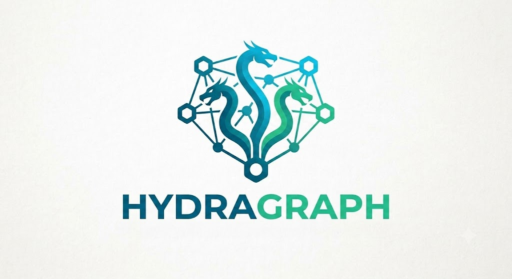

<p align="center">
  
</p>

# Hydra Graph

A spatial 2D conversation tree interface for deep LLM research. Replaces the linear chat scroll with a node-based canvas where every branch is an isolated context — no more cognitive overload from parallel questions, no more context drift from deep dives.


---

## The Problem

Standard LLM chat interfaces fail during complex research:

| Failure Mode | What happens |
|---|---|
| **Parallel Wall** | Ask 5 questions at once → massive wall of text, impossible to track follow-ups |
| **Sequential Drift** | Go 5 turns deep on one question → context window polluted, model loses the thread |

## The Solution

A directed acyclic graph (DAG) where each node is a complete Q&A turn. Branching a node creates a child that inherits only its exact ancestor chain — nothing from sibling branches ever leaks in.

```
[ Root: System Architecture ]
        /           \
[ Branch A:       [ Branch B:
  Indexing ]        Security ]
    /    \
[A1: B+Tree] [A2: LSM]
```

Each branch maintains a clean, isolated context stack. Deep dives stay deep without contaminating parallel threads.

---

## Features

- **Spatial canvas** — pan, zoom, drag nodes freely on a 2D plane
- **Branching** — spawn child nodes from any turn; edges visualize ancestry
- **Context isolation** — each API call compiles only the direct ancestor chain
- **Cascading system prompts** — set a persona at any node; all descendants inherit it unless overridden
- **Local-first / BYOK** — all data in browser IndexedDB, your API key never leaves your machine
- **Real-time streaming** — token-by-token SSE rendering directly from Gemini or Ollama
- **Session restore** — reopen the browser and pick up exactly where you left off

---

## Tech Stack

| Layer | Technology |
|---|---|
| Framework | React 19 + Vite 8 + TypeScript 6 |
| Canvas | [@xyflow/react](https://reactflow.dev) v12 |
| State | [Zustand](https://zustand-demo.pmnd.rs) v5 |
| Storage | [Dexie.js](https://dexie.org) v4 (IndexedDB) |
| Styling | Tailwind CSS v4 |
| LLM | Gemini API (Google AI Studio) · Ollama (local) |

---

## Getting Started

### Prerequisites

- Node.js 18+
- A [Google AI Studio](https://aistudio.google.com) API key, or a running [Ollama](https://ollama.ai) instance

### Install

```bash
git clone https://github.com/your-username/hydra-graph.git
cd hydra-graph
npm install
npm run dev
```

Open `http://localhost:5173`, enter your API key in settings, and start a tree.

### Build

```bash
npm run build
npm run preview
```

### Using a local model (Ollama)

To use Ollama models from the browser, you must allow the app's origin. Configure the `OLLAMA_ORIGINS` environment variable before starting Ollama.

For development (Vite dev server at `http://localhost:5173`):

```bash
OLLAMA_ORIGINS=http://localhost:5173 ollama serve
```

On macOS with Ollama as a background service:

```bash
launchctl setenv OLLAMA_ORIGINS "http://localhost:5173"
```

Then restart Ollama. If the app is served from a different origin (e.g., `http://localhost:4173`), update the value accordingly; use comma-separated values for multiple origins.

**If generations fail instantly:** Check the browser console for a network/CORS error (not a model error message) — this means `OLLAMA_ORIGINS` is not set or incorrect.

---

## Architecture

```
src/
├── components/
│   ├── Canvas.tsx        # React Flow container, node/edge mapping
│   └── TurnNode.tsx      # Custom card node component
├── db/
│   └── ChatDatabase.ts   # Dexie schema (nodes, trees, settings)
├── lib/
│   ├── contextEngine.ts  # Ancestry chain traversal + system prompt resolution
│   └── streamingClient.ts# Native SSE client for Gemini + Ollama
├── store/
│   └── useTreeStore.ts   # Zustand store with IndexedDB persistence
└── types/
    └── index.ts          # TurnNode, ConversationTree, AppSettings
```

### Context Resolution

When a prompt is submitted on any node, the context engine walks up the `parentId` chain to the root, assembles the message array in chronological order, and resolves the nearest ancestor's system prompt override. Sibling branches never appear in this traversal.

---

## Roadmap

### MVP (Phases 1–3)
- [x] Phase 1 — Core foundation: Dexie schema, Zustand store, IndexedDB persistence
- [x] Phase 2 — Canvas: React Flow integration, TurnNode component, drag/branch/edges
- [ ] Phase 3 — Intelligence: context engine, SSE streaming client, live token rendering

### Post-MVP (Phase 4)
- [ ] Auto-layout with `@dagrejs/dagre`
- [ ] Sub-tree collapse/expand with node count badges
- [ ] JSON export/import for session backup
- [ ] Settings panel for API keys and default model
- [ ] System prompt override UI with amber badge

---

## Data Model

Each node on the canvas maps 1:1 to a `TurnNode` record in IndexedDB:

```ts
interface TurnNode {
  id: string           // UUIDv4
  treeId: string       // parent tree
  parentId: string | null  // null = root node
  userPrompt: string
  assistantResponse: string
  systemPromptOverride?: string
  positionX: number
  positionY: number
  status: 'idle' | 'streaming' | 'error'
  modelUsed: string
  inputTokens?: number
  outputTokens?: number
}
```

---

## License

MIT
