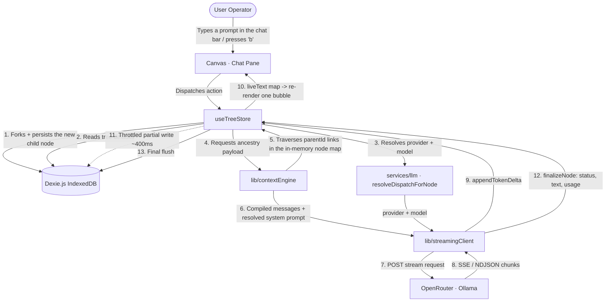
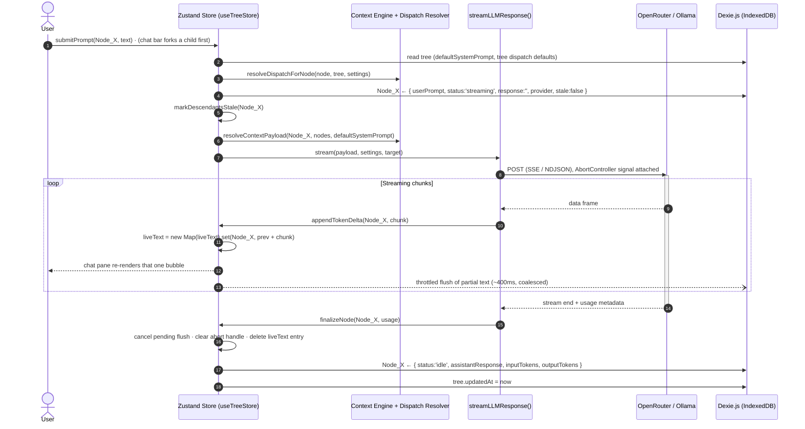

# Software Design Document
## Spatial 2D Conversation Tree Architecture (CTA) for Deep LLM Research

**Document Version:** 2.2.0  
**Status:** As-built — reconciled against the source tree on 2026-09-03 (`main`, through v0.5.0 — OpenRouter + Ollama only, live OpenRouter price catalog, searchable model pickers; and v0.4.0 / Phase 2 — per-node dispatch overrides, fan-out, compare view, cost receipt)  
**Target Audience:** Principal Systems Architects, Lead Engineers, AI CLI Agents (Claude Code, Antigravity CLI)  
**Author:** Lead AI Systems Architect

> **Where this fits.** This is the **permanent** system-characteristics document — how Hydra Graph is built and why. For *where the project is right now* read [`STATUS.md`](STATUS.md); for *what's next* read [`ROADMAP.md`](ROADMAP.md); for *what shipped when* read [`CHANGELOG.md`](CHANGELOG.md). The map of every doc is in [`docs/README.md`](README.md).
>
> **How to read this document.** Sections 1–2 state the problem and the design thesis. Sections 3–6 describe what is actually in `src/`, including the places where the implementation intentionally diverged from the original plan (station-pill canvas nodes instead of full cards, `d3-hierarchy` instead of `dagre`, structure-derived positions instead of manual placement). Known drift and dead code are called out explicitly in §3.3 and §6.7 rather than quietly omitted. The historical phase-by-phase implementation logs are archived under [`docs/archive/`](archive/).

---

## 1. Problem Statement

Modern conversational AI interfaces (e.g., Gemini Web, ChatGPT, Claude.ai) rely almost exclusively on a 1D linear chat stream model. While effective for single-turn or shallow sequential interactions, this paradigm breaks down completely during complex, multi-faceted research tasks.

When a user conducts deep technical research requiring exploration across multiple sub-questions (e.g., evaluating five distinct system trade-offs), they are forced into one of two systemic failure modes:

```
                  ┌─────────────────────────────────────────┐
                  │      Linear Chat Failure Modes          │
                  └────────────────┬────────────────────────┘
                                   │
            ┌──────────────────────┴──────────────────────────┐
            ▼                                                 ▼
┌───────────────────────┐                       ┌───────────────────────┐
│  1. The Parallel Wall │                       │ 2. Sequential Drift   │
├───────────────────────┤                       ├───────────────────────┤
│ • Ask 5 questions at  │                       │ • Ask 1 question and  │
│   once in 1 turn.     │                       │   dive 5 levels deep. │
│ • Causes extreme      │                       │ • Fills context with  │
│   human cognitive     │                       │   low-level noise.    │
│   overload & tracking │                       │ • Attention drift &   │
│   friction.           │                       │   recency bias ruin   │
│                       │                       │   subsequent questions│
└───────────────────────┘                       └───────────────────────┘
```

### 1.1 The Parallel Wall (Cognitive Overload)

If the user prompts the LLM with 5 complex questions simultaneously:

- The LLM responds with a massive wall of text covering all 5 topics.
- Asking follow-up questions requires referencing specific sub-sections within the wall of text.
- The conversation rapidly devolves into an unmanageable, multi-threaded text log inside a single vertical scrollbar, placing an unbearable mental tracking load on the human operator.

### 1.2 The Sequential Drift (Context Degradation)

If the user explores Question 1 deeply across 5 sequential turns before moving to Question 2:

- The shared linear context window becomes polluted with hyper-specific, low-level details from Question 1.
- Due to Recency Bias and Attention Degradation (Needle-in-a-Haystack degradation), the model's understanding of the original overarching research objective degrades when transitioning to Question 2.
- Tokens are wasted sending obsolete intermediate reasoning paths on every subsequent API call.

### 1.3 History Management & Session Friction

Consumer LLM web interfaces provide poor history organization (flat chronological sidebars without hierarchical search or tags). Users hesitate to clear or organize past chats out of fear of polluting personal profile stores, leaving them stranded in unsearchable, unstructured chat logs.

---

## 2. High-Level Solution

The proposed system replaces the 1D linear scrollbar with a Spatial 2D Conversation Tree Architecture (CTA) implemented as a Client-Side, Local-First, Bring-Your-Own-Key (BYOK) application.

```
               [ Root Node: Overall Research Topic ]
                      /                   \
        [ Branch Q1: Deep Dive ]     [ Branch Q2: High-Level ]
             /          \
   [ Sub-topic 1A ]  [ Sub-topic 1B ]
```

### 2.1 Spatial Isolation & Context Decoupled Ancestry

Instead of appending every turn to a single growing string, conversations are structured as a Directed Acyclic Graph (DAG).

- Each node represents an isolated conversational turn.
- To generate a response at any target node, the system traverses upward along the exact ancestor chain to the root, compiling a clean, isolated context stack.
- Deep exploration in Branch A never leaks tokens, noise, or context pollution into Branch B.

### 2.2 Turn Node Aggregation Pattern

To eliminate visual canvas clutter, a single visual node on the 2D canvas captures a complete Q&A Turn (User Prompt + Assistant Response). This halves the visual node count compared to raw message graphs while maintaining full message identity for context compilation.

### 2.3 Cascading System Prompt Inheritance

The system supports global system instructions at the tree root while allowing any node down a branch to set a `systemPromptOverride`. Sub-branches automatically inherit the nearest ancestor's system prompt, enabling side-by-side comparative analysis under different AI personas (e.g., Performance Engineer vs. Security Auditor) on the exact same upstream context.

### 2.4 Local-First BYOK Model

- **$0 Infrastructure Cost:** Runs 100% client-side in the browser.
- **Direct Inference:** Talks directly to OpenRouter (one key for every hosted model, including Gemini via `google/*`, GPT, Claude, Llama, …) or a local runner (Ollama / vLLM) via a user-provided API key.
- **Absolute Privacy:** All conversation history, graph positions, and settings are stored locally in browser IndexedDB.

---

## 3. Detailed Design

### 3.1 Architectural Topology

**High-Level System Architecture**

```
┌──────────────────────────────────────────────────────────────────────────────────────────┐
│                                   BROWSER CLIENT (REACT)                                 │
│                                                                                          │
│  ┌────────────────────┐  ┌────────────────────┐  ┌────────────────────┐                  │
│  │  React Flow Canvas │  │   Chat Pane        │  │   Reader Panel     │   VIEW           │
│  │  (station pills)   │  │ (ancestry stream   │  │  (full text of     │                  │
│  │                    │  │  + input bar)      │  │   one node)        │                  │
│  └─────────┬──────────┘  └─────────┬──────────┘  └─────────┬──────────┘                  │
│            │  user actions / selection            ▲        │                             │
│            ▼                                      │        ▼                             │
│  ┌────────────────────────────────────────────────┴─────────────────────┐                │
│  │  ZUSTAND STORES                                                      │   STATE        │
│  │  useTreeStore (nodes · trees · liveText) · useSettingsStore ·        │                │
│  │  useSelectionStore · useReaderPanel · useSearchNav · useCompareStore │                │
│  └───────┬──────────────────────────────────┬───────────────────────────┘                │
│          │ read/write (async, batched)      │ node map (in-memory, authoritative)        │
│          ▼                                  ▼                                            │
│  ┌────────────────────────┐    ┌──────────────────────────────────────┐                  │
│  │  IndexedDB (Dexie.js)  │    │  PURE LOGIC (src/lib, src/services)  │   LOGIC          │
│  │  nodes · trees ·       │───►│  contextEngine · dispatch resolver · │                  │
│  │  settings·catalog (v5) │    │  autoLayout · ancestry · collapse    │                  │
│  └────────────────────────┘    └───────────────────┬──────────────────┘                  │
│      ▲ defaultSystemPrompt +                       │ resolved payload + target           │
│      │ tree dispatch defaults                      ▼                                     │
│      │                          ┌──────────────────────────────────────┐                 │
│      └──────────────────────────│  streamingClient (fetch + SSE)       │                 │
│         throttled token flush   └───────────────────┬──────────────────┘                 │
└──────────────────────────────────────────────────────┼───────────────────────────────────┘
                                                       │ HTTPS / SSE / NDJSON
                                                       ▼
                                       ┌──────────────────────────────────────┐
                                       │        External Cloud / Local        │
                                       │      OpenRouter · Ollama             │
                                       └──────────────────────────────────────┘
```

**System Sub-component Interaction (Mermaid)**



Two properties of this topology are load-bearing and easy to break:

1. **The store is the authoritative live copy; Dexie is the durable mirror.** Ancestry traversal reads the in-memory node map, never IndexedDB. The only DB read on the submit path is the tree record.
2. **In-flight tokens bypass the node record.** They accumulate in `liveText`, keyed by node id, so a token delta never produces a new `TurnNode` object and never invalidates unrelated React Flow nodes.

### 3.2 Technology Stack Matrix

| Layer | Technology | Version | Selection Rationale |
|---|---|---|---|
| Framework | React + Vite | ^19.2 / ^8.1 | Blazing fast HMR, small bundle footprint, native TypeScript support. |
| Language | TypeScript | ~6.0 | Strict typing across state, database, and API payloads. |
| Canvas Engine | @xyflow/react (React Flow) | ^12.11 | Industry standard for 2D node graphs. Pan/zoom, custom node rendering, edge routing, and viewport controls out of the box. |
| State Management | Zustand | ^5.0 | Unopinionated, ultra-fast client state manager with zero boilerplate. Handles fast-frequency streaming token updates without triggering re-render loops across unrelated nodes. |
| Local Database | Dexie.js | ^4.4 | Minimalist wrapper around browser IndexedDB. ACID-compliant local storage with index queries for O(1) node lookups. |
| Layout Engine | d3-hierarchy | ^3.1 | Deterministic top-to-bottom tree layout (`hierarchy` + `tree().nodeSize()`). Same tree structure in → identical coordinates out. |
| Markdown Rendering | react-markdown + remark-gfm + rehype-highlight | ^10.1 / ^4.0 / ^7.0 | GFM tables/strikethrough plus syntax-highlighted fenced code in the chat pane and reader panel. (`highlight.js` arrives transitively via `rehype-highlight`; its `github-dark` stylesheet is imported by `MarkdownContent.tsx`.) |
| Icons | lucide-react | ^1.27 | Tree-shakeable SVG icon set used across pills, header, and panels. |
| Styling | Tailwind CSS + @tailwindcss/vite | ^4.3 | Dark slate/indigo palette; Vite-native plugin, no PostCSS config. |
| HTTP/SSE Client | Native fetch + ReadableStream | Web Standard | Zero external dependency weight for handling HTTP POST Server-Sent Event streaming responses. |
| Test Runner | Vitest + Testing Library + jsdom + fake-indexeddb | ^4.1 / ^16.3 / ^30.0 / ^6.2 | Component and store tests run against a real (in-memory) IndexedDB, so Dexie transactions are exercised rather than mocked. |
| Linter | oxlint | ^1.71 | Fast Rust-based lint pass wired into `npm run check`. |

**Auto-layout** runs on `d3-hierarchy` (migrated from `@dagrejs/dagre` in the Phase 3 enhancement pass). `@dagrejs/dagre` was removed from `package.json` in v0.3.1.

**npm scripts:** `dev`, `build` (`tsc -b && vite build`), `typecheck` (`tsc -b`), `lint` (`oxlint`), `test` (`vitest run`), and `check` (typecheck + lint + test).

_This table records the versions actually installed in `package.json`. Update it whenever a major dependency version changes._

### 3.3 Main Architectural System Components

The running application is a three-region shell (header / split workspace / reader panel) sitting on top of seven Zustand stores and a pure-function library. Nothing renders server-side; every module below ships to the browser.

**Application Shell (`src/App.tsx`, `src/main.tsx`):** Owns the one-time boot sequence — load persisted settings into *both* stores, kick off `useCatalogStore.loadCatalog()` (price catalog, non-blocking), load the tree index, restore `activeTreeId` (or create a `New Research` tree on first run) — then renders `HeaderBar`, `SplitLayout`, and `ReaderPanel`. In dev builds it also installs the render-tally harness on `window`.

**Canvas View Engine (React Flow layer):** `Canvas.tsx` is a thin JSX shell; all store→graph derivation lives in the `useCanvasGraph` hook (node wrappers, edge list, hidden-node filtering, active-path dimming, and a referentially-stable wrapper cache that prevents one node's change from re-rendering every other node). Four headless components mounted inside `<ReactFlow>` own the imperative viewport behaviours: `CanvasFitter` (fit-view on nonce), `CanvasSearchFocus` (pan + flash a search hit), `CanvasSelectionSync` (the single auto-center path shared by canvas clicks, chat clicks, and fresh spawns), and `CanvasViewport` (viewport persistence + keyboard navigation). Manual node dragging and manual node resizing are **disabled** — positions are 100% derived from tree structure.

**Turn Node ("station pill"):** `TurnNode.tsx` renders a fixed 240×72 pill: role icon, one-line `stationSummary()` label, branch-count badge, collapse chevron, status/selection ring, and `PillActions` (delete + inline confirmation). Full text is *not* rendered on canvas — double-clicking a pill opens the `ReaderPanel`.

**Chat Pane:** `ChatStreamView` renders the active node's lineage (`getAncestryChain`) as an ordered list of `ChatMessage` bubbles with Markdown, live streaming text, and token telemetry; `ChatInputBar` submits a prompt by forking a fresh child off the active node.

**Reader Panel:** `ReaderPanel` is a right-hand drawer showing one node's full prompt + response, an estimated-context read-out with an over-budget warning, per-turn dollar cost, and copy-to-clipboard. Since v0.4.0 it also mounts `NodeDispatchControls` — the per-node provider override (with an "Inherit" choice), model field, and persona / system-prompt editor with presets (`src/lib/personaPresets.ts`). Edits persist through `updateNode` and take effect on the next Regenerate.

**Fan-out & Compare (v0.4.0).** `ChatInputBar`'s `Split` button opens `FanOutModal` (shared prompt + 2–4 `FanOutRow` variants, each a provider / model / persona), which calls `useTreeStore.fanOutAndSubmit` to fork N siblings off one parent and dispatch the same prompt into all of them in parallel. `HeaderBar`'s **Compare** button (enabled when the active node has ≥2 siblings) opens `CompareView` — a full-screen overlay laying selected siblings out column by column (`CompareColumn`), with the shared-ancestry context (inherited turn count + `estimateContextTokens`) stated on screen. `HeaderBar`'s **$** button toggles `CostReceipt`.

**Context Builder Engine (`src/lib/contextEngine.ts`):** Pure graph traversal. Given a node id and the node map, it follows `parentId` pointers to the root, resolves the cascading system prompt (nearest ancestor override wins, else the tree default), and unfolds the chain into an ordered `MessagePayload[]`. The target node's own (in-progress) response is deliberately excluded.

**Dispatch Resolver (`src/services/llm.ts`):** Resolves *which* provider and model a prompt uses, in precedence order node override → tree default → global settings (per-provider default, then flat fallback). The node override is `TurnNode.providerOverride` (provider) and `TurnNode.modelUsed` (model); `resolveDispatchForNode` forwards both. Resolved fresh on every submit, so a Settings change applies on the very next prompt without a reload. `submitPrompt` stamps the resolved provider **and** model back onto the turn. `FanOutVariant` is the same override shape used by `fanOutAndSubmit`.

**LLM Streaming Client (`src/lib/streamingClient.ts`):** One `streamLLMResponse()` entry point fanning out to two provider implementations (OpenRouter `/chat/completions`, Ollama `/api/chat`), each built on `fetch` + `ReadableStream` with a shared line-buffering pattern, `AbortController` cancellation, malformed-payload guards, and per-provider usage-metadata extraction. The native Gemini client (`:streamGenerateContent?alt=sse`, `x-goog-api-key`) was removed in v0.5.0 — Gemini models now route through OpenRouter as `google/*`.

**Model Catalog (`src/lib/openRouterCatalog.ts` + `src/store/catalogStore.ts`):** `fetchOpenRouterModels()` reads OpenRouter's public `GET /api/v1/models` and `normalizeCatalog()` maps it to `CatalogModel[]` (`inputPerM` / `outputPerM` per 1M tokens, a `tier` of `cheap | mid | frontier` from output-price percentiles). `useCatalogStore.loadCatalog(force?)` refetches on load when online (in-session `TTL_MS` = 1 h), caches the list to the Dexie `catalog` store, and on failure falls back to that cache, then to the committed `BUNDLED_CATALOG` (`src/lib/bundledCatalog.ts`, regenerated by `scripts/refresh-catalog.mjs`). `source` / `fetchedAt` / `status` are shown in Settings. This catalog is the single price source for `pricing.ts`. Added v0.5.0.

**Local Persistence Manager (`src/db/ChatDatabase.ts`):** Dexie subclass exposing `nodes`, `trees`, `settings`, and (since v5) `catalog` tables with five versioned schema migrations (see §3.4). Streaming writes are throttled (~400 ms) and layout writes are batched into a single `rw` transaction.

**State Layer (7 Zustand stores):**

| Store | File | Responsibility |
|---|---|---|
| `useTreeStore` | `src/store/useTreeStore.ts` | The central store: node map, tree list, active tree, in-flight `liveText`, and every mutating action (`addNode`, `submitPrompt`, `forkAndSubmit`, `fanOutAndSubmit`, `cancelGeneration`, `deleteNodeSubtree`, `markDescendantsStale`, `toggleCollapse`, `relayoutActiveTree`, tree CRUD, `importTree`). Holds **no** settings copy — reads `useSettingsStore.getState()` when it needs the default model, and calls `setActiveTreeId` after a tree load/create. |
| `useSettingsStore` | `src/store/settingsStore.ts` | Single source of truth for provider configuration **and the last-opened tree** (`activeTreeId`), persisted to the `global_settings` row. Backfills newly-added fields on load. |
| `useSelectionStore` | `src/store/useSelectionStore.ts` | `selectedNodeId` plus a `focusNonce`; `setSelectedNodeId` (no re-center) vs `selectAndFocus` (re-center). |
| `useReaderPanel` | `src/components/useReaderPanel.ts` | Which node, if any, the reader drawer is showing. |
| `useSearchNav` | `src/components/useSearchNav.ts` | Search "fly to this node" target + nonce. |
| `useCompareStore` | `src/store/useCompareStore.ts` | Compare-view overlay: `open`, the `anchorId` whose siblings are compared, and the `excludedIds` set the user has unchecked. Added in v0.4.0. |
| `useCatalogStore` | `src/store/catalogStore.ts` | The OpenRouter price catalog: `models`, `fetchedAt`, `status`, `source` (`live` / `cache` / `bundled`), and `loadCatalog(force?)` (1 h TTL, IndexedDB cache, `BUNDLED_CATALOG` fallback). The price source for `pricing.ts`; cost components subscribe to it. Added in v0.5.0. |

**Settings have one owner (`useSettingsStore`).** Since v0.3.1 `useTreeStore` no longer
carries its own `settings` field or `loadSettings` / `saveSettings` pair. Everything that
needs configuration reads `useSettingsStore` — `SettingsModal` writes it, `HeaderBar`'s
"no provider configured" banner subscribes to it (so it clears the instant a key is
saved), and `submitPrompt` / `createTree` / `forkAndSubmit` / the `b`-key branch read
`useSettingsStore.getState()` fresh. The last-opened tree (`activeTreeId`) is persisted
through `useSettingsStore.setActiveTreeId`, which `loadTree` / `createTree` call after
committing their state. `App.tsx` hydrates `useSettingsStore` once at boot and, if the
remembered tree is gone, falls back to the newest tree (or creates one).

**Pure Library (`src/lib/`)** — no store access, no side effects, individually unit-tested:

| Module | Purpose |
|---|---|
| `ancestry.ts` | `getAncestryChain()` → `[root … selected]`, cycle- and broken-pointer-safe. |
| `autoLayout.ts` | `layoutTree()` deterministic d3-hierarchy layout; `computeChildPosition()` for a hypothetical new child. |
| `collapse.ts` | `computeHiddenIds()` — nodes with a collapsed ancestor. |
| `contextEngine.ts` | `resolveContextPayload()` (see §5.1). |
| `contextEstimate.ts` | ~4-chars-per-token heuristic + `CONTEXT_WARN_TOKENS` budget. |
| `nodeDimensions.ts` | Shared `NODE_WIDTH = 240` / `NODE_HEIGHT = 72`. |
| `pathHighlight.ts` | Active-path id set, edge styling, off-path dim class. |
| `personaPresets.ts` | `PERSONA_PRESETS` — ready-made system-prompt personas for `NodeDispatchControls` and `FanOutRow`. Added v0.4.0. |
| `pricing.ts` | `resolvePrice(model, provider?, catalog?)` / `turnCostUSD(node, catalog?)` / `formatUSD`. Since v0.5.0 the static `MODEL_PRICING` table is gone — `catalog` defaults to `useCatalogStore.getState().models` (the live OpenRouter catalog); Ollama turns price `{0,0}`. Still synchronous and pure. Added v0.4.0. |
| `openRouterCatalog.ts` | `fetchOpenRouterModels()` + `normalizeCatalog()` — OpenRouter `/api/v1/models` → `CatalogModel[]` with per-1M prices and a derived `tier`. Fetch + transform only; no store. Added v0.5.0. |
| `bundledCatalog.ts` | `BUNDLED_CATALOG` — a committed catalog snapshot for offline / first-run / the no-key demo; regenerated by `scripts/refresh-catalog.mjs`. Added v0.5.0. |
| `providerOptions.ts` | `providerOptions({ inherit? })` — the two-entry provider list (OpenRouter, Ollama) shared by every provider `<select>`. Added v0.5.0. |
| `tierSpread.ts` | `tierSpread(models, configured, n)` — picks `n` models walking cheap→mid→frontier of the live catalog for the fan-out "spread across price tiers" fill. Added v0.5.0. |
| `formatModelRef.ts` | `formatModelRef()` — `provider/model` helper text for fan-out rows. Added v0.5.0. |
| `treeCost.ts` | `treeCostSummary(nodes, catalog?)` — this tree's actual spend vs. the one-linear-thread counterfactual ("context you didn't pay for"). Added v0.4.0. |
| `stationSummary.ts` | 7-word / 48-char single-line pill label. |
| `streamingClient.ts` | Provider SSE clients. |
| `treeExport.ts` | Versioned JSON export doc, filename slug, download, parse + id-remapped import. |
| `treeNav.ts` | Arrow-key target resolution + `isTypingTarget()` guard. |
| `viewportCenter.ts` | `centerTarget()` — never zooms an already zoomed-in user back out. |
| `renderTally.ts` | Dev-only render counting + a synthetic-tree seeder installed on `window`. |

**Turn recovery UI.** `MessageActions.tsx` (mounted by `ChatMessage` and `ReaderPanel`)
renders exactly one control per turn: **Stop** while it streams (`cancelGeneration`),
**Retry** on an errored turn (always shown), **Regenerate** on the active idle turn —
both the latter call `submitPrompt(node.id, node.userPrompt)`. This is the only live
surface for those two store actions since the pill refactor.

The six pre-pill full-card components (`NodeFooter`, `PromptSection`, `ResponseArea`,
`ContextMeter`, `ModelPicker`, `SystemPromptEditor`) and their tests were **deleted** in
v0.3.1. Per-node model picking and per-node system-prompt editing were rebuilt in v0.4.0
as `NodeDispatchControls` in the reader panel — not revived from the deleted files.

### 3.4 Schemas (Matrix Representation)

The canonical TypeScript definitions live in `src/types/index.ts`; the matrices below mirror them field-for-field.

**Schema Matrix 1: TurnNode (The Atomic Canvas Element)**

| Field Name | Data Type | Nullable | Description | Architectural Usage |
|---|---|---|---|---|
| id | String (UUIDv4) | No | Globally unique identifier generated on client creation. | Primary Key for database indexing and React Flow node binding. |
| treeId | String (UUIDv4) | No | Foreign key linking node to its parent ConversationTree. | Fast query filtering (`db.nodes.where('treeId').equals(id)`). |
| parentId | String (UUIDv4) | Yes | ID of the immediate parent node. `null` if this is the Root Node. | Pointer used to build upstream ancestry chains during context assembly. |
| childrenIds | Array\<String\> | No | Array of child node IDs branching directly from this node. | Downstream sub-tree traversal, layout, collapse mechanics, branch-count badge. |
| userPrompt | String | No | Raw input text submitted by the human operator. | Extracted as `{ role: 'user', content: userPrompt }` in ancestry chain. |
| assistantResponse | String | No | Markdown output generated by the LLM. | Extracted as `{ role: 'assistant', content: assistantResponse }` in ancestry chain. |
| systemPromptOverride | String | Yes | Optional system prompt instruction specific to this branch. | Overrides upstream system prompts for this node and all descendant sub-trees; renders the amber shield icon on the pill. Editable via `NodeDispatchControls` (reader panel) since v0.4.0. |
| providerOverride | Enum String | Yes | `'openrouter' \| 'ollama'` — explicit per-turn provider override (**input** to dispatch resolution). | Highest-precedence provider in `resolveDispatchForNode`. Distinct from `provider`, which records what actually ran. Set by `NodeDispatchControls` / `fanOutAndSubmit`. Optional field — no DB migration (like `systemPromptOverride`). Added v0.4.0; `'gemini'` remapped to `'openrouter'` by DB v5. |
| positionX | Number (Float) | No | X-coordinate on the 2D canvas plane. | Written by the deterministic layout, read by React Flow. Not user-editable (dragging is disabled). |
| positionY | Number (Float) | No | Y-coordinate on the 2D canvas plane. | As above. |
| isCollapsed | Boolean | No | Flag indicating if downstream child nodes are hidden from view. | Drives `computeHiddenIds()`; toggles the chevron and the "Show N hidden" tooltip. |
| status | Enum String | No | Values: `'idle'`, `'streaming'`, `'error'`. | Controls pill status ring, spinner icon, and error styling. |
| modelUsed | String | No | Identifier of the LLM model (e.g., `'google/gemini-2.5-flash'`, `'openai/gpt-4o-mini'`). | Doubles as the node-level model override (highest-precedence model input to the dispatch resolver) **and** the post-run record — `submitPrompt` writes the resolved model back here. Shown in the chat telemetry line and priced against the live catalog by `pricing.ts`. DB v5 best-effort remaps historical bare `gemini-*` ids to `google/*`. |
| inputTokens | Number | Yes | Token count of the upstream context payload sent to API. | Cost tracking (`turnCostUSD`, `treeCostSummary`), usage reporting, context window boundary warnings. |
| outputTokens | Number | Yes | Token count of the response generated by the model. | Cost tracking (`turnCostUSD`, `treeCostSummary`) and generation throughput metrics. |
| timestamp | Number (Int64) | No | Epoch timestamp (milliseconds) of node creation. | Chronological sorting; also breaks ties when picking the layout root. |
| provider | Enum String | Yes | `'openrouter' \| 'ollama'` — the provider that produced this turn. | Stamped on every submit by the dispatch resolver; auditing. Added in DB v2; `'gemini'` remapped to `'openrouter'` by DB v5. |
| errorMessage | String | Yes | Raw provider error text when `status === 'error'`. | Rendered verbatim in the chat bubble. Added in DB v2. |
| width | Number | Yes | Legacy per-node width. | **Vestigial.** Manual resize was removed; every pill renders at `NODE_WIDTH`. Retained only so old rows and old exports still parse. Added in DB v3. |
| height | Number | Yes | Legacy per-node height. | **Vestigial**, as above (`NODE_HEIGHT`). Added in DB v3. |
| stale | Boolean | Yes | Set on every descendant when an ancestor is re-prompted. | Dims the pill, shows the amber history icon, and exposes a screen-reader sentence. Cleared when the node itself is re-submitted. Added in DB v3. |

**Schema Matrix 2: ConversationTree (The Document Workspace)**

| Field Name | Data Type | Nullable | Description | Architectural Usage |
|---|---|---|---|---|
| id | String (UUIDv4) | No | Unique identifier for the research document. | Primary Key. |
| title | String | No | User-facing workspace name (e.g., "Database Research"). | Displayed in the header `TreeSwitcher`; slugified into the export filename. |
| rootNodeId | String (UUIDv4) | No | ID of the foundational depth-0 node of the tree. | Starting point for tree loading and full-graph rendering. |
| defaultSystemPrompt | String | No | Baseline system prompt instruction applied to all nodes. | Fallback when no ancestor specifies a `systemPromptOverride`. Seeded to `'You are a helpful AI research assistant.'`. |
| createdAt | Number (Int64) | No | Epoch creation timestamp. | Sorting documents. |
| updatedAt | Number (Int64) | No | Epoch last-modified timestamp. | Bumped by `touchActiveTree()` on node add/finalize/delete/prompt-edit; orders the tree switcher. |
| viewportX | Number | Yes | Persisted canvas pan X. | Restored on tree load; debounced ~400 ms on pan/zoom. Added in DB v4. |
| viewportY | Number | Yes | Persisted canvas pan Y. | As above. Added in DB v4. |
| viewportZoom | Number | Yes | Persisted canvas zoom. | As above; falls back to `fitView()` when absent. Added in DB v4. |
| defaultProvider | Enum String | Yes | Tree-scoped provider default. | Middle tier of dispatch resolution (§5.2). |
| defaultModel | String | Yes | Tree-scoped model default. | Middle tier of dispatch resolution (§5.2). |

**Schema Matrix 3: AppSettings (Global Client Configuration)**

| Field Name | Data Type | Nullable | Description | Architectural Usage |
|---|---|---|---|---|
| id | String | No | Constant key (always `'global_settings'`). | Single-row local config store. |
| provider | Enum String | No | Active provider: `'openrouter' \| 'ollama'`. | Last-resort provider in dispatch resolution. Defaults to `'openrouter'`. `geminiApiKey` and the `'gemini'` value were removed in v0.5.0 (DB v5 drops the key and remaps the value). |
| openRouterApiKey | String | Yes | User's personal OpenRouter API key. | Sent as `Authorization: Bearer …`. The one credential the Settings screen shows when `provider === 'openrouter'`. |
| ollamaBaseUrl | String | No | Endpoint URL for local LLM (default `http://localhost:11434`). | Target host for local inference streaming. |
| openRouterBaseUrl | String | Yes | OpenRouter endpoint (default `https://openrouter.ai/api/v1`). | Read by `streamingClient.ts` (since v0.3.1) and by `fetchOpenRouterModels()` for the price catalog; trailing slash tolerated. Editable under Settings → `Advanced`. |
| defaultModel | String | No | Flat fallback model. | Last resort when no per-provider default matches. |
| defaultModels | Map\<Provider, String\> | Yes | Per-provider default model map. | Preferred model source once a provider is known. Seeded with `openai/gpt-4o-mini` / `llama3` (the `gemini` slot was dropped in v0.5.0 / DB v5). |
| activeTreeId | String (UUIDv4) | Yes | Currently open conversation tree ID. | Restores session state automatically on application startup. |

**Schema Matrix 4: Dexie Database Versions (`HydraGraphDB`)**

The `nodes` / `trees` / `settings` stores and their indexes were unchanged through v4 — every bump to that point backfilled new optional fields onto rows written by an older build. v5 is the first to add a store (`catalog`) and the first to rewrite existing field values.

| Version | Stores / Indexes | Upgrade Behaviour |
|---|---|---|
| 1 | `nodes: id, treeId, parentId, timestamp` · `trees: id, createdAt, updatedAt` · `settings: id` | Initial schema. |
| 2 | unchanged | Infers `settings.provider` from the presence of `geminiApiKey`; stamps that provider plus an empty `errorMessage` onto every existing node. |
| 3 | unchanged | Backfills `width: 320`, `height: 240`, `stale: false` on existing nodes. (The width/height defaults predate fixed-size pills and are now inert.) |
| 4 | unchanged | Backfills `viewportX: 0`, `viewportY: 0`, `viewportZoom: 1` on existing trees. |
| 5 | adds `catalog: key` (cached OpenRouter model list, one row per source key) | Native Gemini removal. Settings: `provider: 'gemini' → 'openrouter'`, delete `geminiApiKey`, drop `defaultModels.gemini`, remap `defaultModel` `gemini-*` → `google/*`. Nodes: `provider` / `providerOverride` `'gemini' → 'openrouter'`, best-effort remap `modelUsed` bare `gemini-*` ids → `google/*`. Best-effort / lossy by design (pre-launch, dev's own data). |

**Schema Matrix 5: TreeExportDoc (Backup Interchange Format)**

Defined in `src/lib/treeExport.ts`. `TREE_EXPORT_SCHEMA_VERSION = 1`; an import whose `schemaVersion` differs is rejected with an explicit message rather than best-effort parsed.

| Field | Type | Description |
|---|---|---|
| schemaVersion | Number | Must equal the reader's `TREE_EXPORT_SCHEMA_VERSION`. |
| exportedAt | Number (Int64) | Epoch export timestamp. |
| tree | ConversationTree | Deep-copied tree record. |
| nodes | Array\<TurnNode\> | Deep-copied node records (including `childrenIds`). |

On import, `remapImportedTree()` regenerates every id (tree, nodes, `parentId`, `childrenIds`, `rootNodeId`) so a document can be re-imported alongside its original without collisions. Filenames are `<title-slug>-YYYY-MM-DD.json`.

## 4. UI/UX Definitions

> **Revision note.** The original single-pane, full-card canvas described in v1.1 of this document has been superseded. Reading and composing now happen in a linear chat pane; the canvas is a compact *wayfinding* surface ("subway map"), not a reading surface.

### 4.1 Application Shell Layout

```
┌──────────────────────────────────────────────────────────────────────────────────────────────┐
│ [ Tree ▾ ]            [ 🔍 Search this tree… ]            [ ⛶ Re-layout ][ ⬇ ][ ⬆ ][ ⚙ ]     │  HeaderBar (h-12)
├──────────────────────────────────────────────────────────────────────────────────────────────┤
│ ⚠ No LLM provider configured. Add a key or point at Ollama.                  [Open settings] │  conditional banner
├───────────────────────────────────┬────┬─────────────────────────────┬───────────────────────┤
│         GRAPH PANE (40%)          │ ║  │      CHAT PANE (60%)        │   READER PANEL        │
│                                   │ ║  │                             │   (28rem / ≤40vw,     │
│      ╭───────────────────╮        │ ║  │  ┌───────────────────────┐  │    only when open)    │
│      │ 🤖 Root · summary │        │ ║  │  │ user bubble (right) ▸ │  │                       │
│      ╰─────────┬─────────╯        │ ║  │  └───────────────────────┘  │  Full text            │
│         ╭──────┴──────╮           │ ║  │  ┌───────────────────────┐  │  ~1,240 tokens ctx    │
│         ▼             ▼           │ ║  │  │ ◂ assistant bubble    │  │  ─────────────────    │
│  ╭────────────╮ ╭────────────╮    │ ║  │  │   (markdown + code)   │  │  User prompt          │
│  │ 💬 summary │ │ 🛡 summary │    │ ║  │  │   model · N in/M out  │  │  Assistant response   │
│  ╰────────────╯ ╰──────┬─────╯    │ ║  │  └───────────────────────┘  │  (markdown)           │
│                        ▼          │ ║  ├─────────────────────────────┤                       │
│                 ╭────────────╮    │ ║  │ [ Reply on this branch…  ]▶ │                       │
│                 │ ⚠ summary  │    │ ║  │                             │                       │
│                 ╰────────────╯    │ ║  │                             │                       │
└───────────────────────────────────┴────┴─────────────────────────────┴───────────────────────┘
                                      ▲
                          draggable divider (ratio clamped 20–80%)
```

| Region | Component | Notes |
|---|---|---|
| Header | `HeaderBar` | Tree switcher (rename/delete/new), full-text search, re-layout (with a confirm banner), JSON export, JSON import, **$** cost-receipt popover (`CostReceipt`), **Compare** button (`useCompareStore.openCompare`, enabled at ≥2 siblings), settings modal. Shows an amber "no provider configured" banner when there is no OpenRouter key and the Ollama URL is still the untouched default. |
| Graph pane | `SplitLayout` → `Canvas` | Default 40% width, resized by a pointer-driven vertical divider, clamped to 20–80%. Ratio is component state — not persisted. |
| Chat pane | `ChatStreamView` + `ChatInputBar` | Ancestry-only stream for the active node; empty turns are filtered out; auto-scrolls while streaming. `ChatInputBar` has a `Split` button opening `FanOutModal`. |
| Reader panel | `ReaderPanel` | Right drawer, fixed `28rem` capped at `40vw`, mounted only when a node is open. Hosts `NodeDispatchControls` (per-node provider / model / persona) and per-turn cost. |
| Compare overlay | `CompareView` + `CompareColumn` | Full-screen `z-40` overlay from `useCompareStore`; siblings of the anchor column-by-column with a checkbox strip, the shared-context guarantee line, and per-column cost. Escape closes. |

### 4.2 Station Pill Geometry (Canvas Node)

Fixed `NODE_WIDTH = 240` × `NODE_HEIGHT = 72` (`src/lib/nodeDimensions.ts`), consumed by both the React Flow wrapper and the layout engine (`nodeSize([W + 64, H + 90])`).

```
                 ╭──────────────────────────────────────────╮  ← status/selection ring
   target handle │ ⬤ ▏ YOU                          ⑂3  ⌄  │
        (top)    │ 🛡 ▏ Explain index traversal perf…       │  ← stationSummary(): ≤7 words / ≤48 chars
                 ╰──────────────────────────────────────────╯  ← source handle (bottom)
                     ▲        ▲                    ▲    ▲
                role icon  role label       branch badge  collapse chevron
                                            (only >1 child)   (only if collapsed or has children)

   [🗑] delete + inline confirm appears at the top-right corner while selected (PillActions)
```

Role icon precedence: `Shield` (system override) → `TriangleAlert` (error) → `Loader` (streaming) → `Bot` (root) → `MessageCircle` (branch).

### 4.3 Node & Edge Visual States Matrix

| State | Trigger | Pill Appearance | Edge Appearance |
|---|---|---|---|
| Idle (default) | `status === 'idle'` | Slate pill, `ring-1 ring-slate-700`. | Indigo `#4F46E5`, width 2 (only when nothing is selected). |
| Streaming | `status === 'streaming'` | Pulsing cyan ring (`ring-2 ring-cyan-400 animate-pulse`) + spinning `Loader` icon. Live tokens render in the chat pane, not on the pill. | — |
| Execution error | `status === 'error'` | Red ring (`ring-2 ring-red-500`) + `TriangleAlert`. Raw provider message shown in the chat bubble. | — |
| Selected | React Flow selection | Indigo `ring-2 ring-indigo-400`; `PillActions` fade in. | — |
| On active path | node ∈ `root → selected` | Normal opacity. | Animated cyan accent `#22d3ee`, width 3. |
| Off active path | a selection exists, node ∉ path | `opacity-40 saturate-50`. | Dim slate `#1E293B`, width 1.5, `opacity 0.35`. |
| Collapsed sub-tree | `isCollapsed` | Chevron flips to `ChevronRight`, tooltip `Show N hidden`; descendants are removed from the graph entirely (`computeHiddenIds`). | Edges into hidden nodes are dropped. |
| System override | `systemPromptOverride` set | Amber `Shield` icon replaces the role icon. | — |
| Stale | `stale === true` | `opacity-70` + amber `History` icon + a screen-reader sentence: *"An ancestor changed after this answer was generated — it may be out of date."* | — |

### 4.4 Interaction & Keyboard Map

| Input | Context | Action |
|---|---|---|
| Click pill | Canvas | Selects the node, smoothly centers it (`FOCUS_DURATION` 450 ms, zoom clamped up to `MIN_FOCUS_ZOOM` 0.9), and repoints the chat pane. |
| Double-click pill | Canvas | Opens the `ReaderPanel` for that node. |
| Click a chat turn | Chat pane | `selectAndFocus` — same select + center path as a canvas click. |
| `↑` / `↓` | Canvas focused, not typing | Move to parent / first child. |
| `←` / `→` | Canvas focused, not typing | Move to previous / next sibling. |
| `b` | Canvas focused, not typing | Spawn an empty child branch off the selected node. |
| `r` | Canvas focused, not typing | Open the reader panel for the selected node. |
| `Esc` | Reader panel open | Close the reader panel. |
| `Enter` / `Shift+Enter` | Chat input | Submit (fork + dispatch) / newline. |
| Scroll · pinch · drag | Canvas | Pan and zoom, `minZoom 0.2` – `maxZoom 2`; the viewport is persisted per tree, debounced ~400 ms. |

All keyboard handlers short-circuit via `isTypingTarget()` so typing in an input, textarea, select, or contenteditable never triggers navigation. Node dragging is disabled; `deleteKeyCode` is `null` so the Delete key cannot remove nodes implicitly.

## 5. Execution Flows & Sequence Specifications

### 5.1 Ancestry Context Traversal & System Prompt Resolution Algorithm

Implemented verbatim in `src/lib/contextEngine.ts` (unit tests: `contextEngine.test.ts`).

```typescript
// Architectural Specification: Context Resolution Engine
interface MessagePayload {
  role: 'user' | 'assistant';
  content: string;
}

interface ContextResolutionResult {
  systemPrompt: string;
  messages: MessagePayload[];
}

function resolveContextPayload(
  targetNodeId: string,
  nodeMap: Map<string, TurnNode>,
  globalDefaultSystemPrompt: string
): ContextResolutionResult {
  const ancestryChain: TurnNode[] = [];
  let currentNodeId: string | null = targetNodeId;

  // 1. Walk upward using parentId pointers
  while (currentNodeId !== null) {
    const node = nodeMap.get(currentNodeId);
    if (!node) break;

    ancestryChain.unshift(node); // Prepend to preserve chronological order
    currentNodeId = node.parentId;
  }

  // 2. Resolve Cascading System Prompt
  // Scan backwards (from target node up to root) for the first explicit override
  let resolvedSystemPrompt = globalDefaultSystemPrompt;
  for (let i = ancestryChain.length - 1; i >= 0; i--) {
    if (ancestryChain[i].systemPromptOverride && ancestryChain[i].systemPromptOverride!.trim() !== '') {
      resolvedSystemPrompt = ancestryChain[i].systemPromptOverride!;
      break; // Found nearest ancestor override
    }
  }

  // 3. Unfold Turn Nodes into API Message Array
  const messages: MessagePayload[] = [];
  for (const node of ancestryChain) {
    if (node.userPrompt && node.userPrompt.trim() !== '') {
      messages.push({ role: 'user', content: node.userPrompt });
    }
    // Only append assistant response if it exists (skip current node's empty response)
    if (node.assistantResponse && node.assistantResponse.trim() !== '' && node.id !== targetNodeId) {
      messages.push({ role: 'assistant', content: node.assistantResponse });
    }
  }

  return {
    systemPrompt: resolvedSystemPrompt,
    messages: messages
  };
}
```

The traversal reads the **in-memory Zustand node map**, not IndexedDB — the store is the authoritative live copy and Dexie is the durable mirror. The only DB read in the submit path is `db.trees.get(activeTreeId)`, to pick up `defaultSystemPrompt` and the tree-level dispatch defaults.

A sibling helper, `getAncestryChain()` (`src/lib/ancestry.ts`), performs the same upward walk but returns the raw `[root … selected]` node array for UI use (chat stream, active-path highlighting). It additionally guards against cycles with a `visited` set.

### 5.2 Dispatch Resolution (Which Provider / Which Model)

Implemented in `src/services/llm.ts`, re-resolved on **every** submit so Settings changes take effect on the next prompt with no reload.

```
             ┌──────────────────────────────┐
  highest    │ 1. Node override             │  node.providerOverride +
  priority   │    (this turn)               │     node.modelUsed
             ├──────────────────────────────┤
             │ 2. Tree default              │  tree.defaultProvider / tree.defaultModel
             ├──────────────────────────────┤
             │ 3a. Per-provider default     │  settings.defaultModels[provider]
  lowest     │ 3b. Flat fallback            │  settings.defaultModel · settings.provider
             └──────────────────────────────┘
```

Provider and model resolve independently: the provider is the first non-null of `node.providerOverride` → `tree.defaultProvider` → `settings.provider` (only `'openrouter'` or `'ollama'` since v0.5.0), then the model is the first non-empty of `node.modelUsed` → `tree.defaultModel` → `settings.defaultModels[resolvedProvider]` → `settings.defaultModel`. The resolved provider **and** model are stamped back onto the node so a turn always records what actually generated it. `fanOutAndSubmit` seeds each child's `providerOverride` / `modelUsed` / `systemPromptOverride` from its `FanOutVariant` before dispatch, so N siblings resolve to N different targets off identical ancestry.

Model ids are still free text — the `ModelSelect` combobox surfaces the live OpenRouter catalog (`useCatalogStore`) as priced suggestions for `provider === 'openrouter'` and a plain input for Ollama, but a hand-typed id is always accepted. The catalog only feeds suggestions and pricing (`pricing.ts`), never resolution itself; an unknown `modelUsed` dispatches unchanged and simply shows no cost.

### 5.3 SSE Real-time Streaming & Synchronization Sequence

Streaming text does **not** live on the node record while in flight. It accumulates in a separate `liveText: Map<nodeId, string>` in the store, so a token delta creates one small new Map rather than a new node object — unrelated React Flow nodes never re-render. Dexie receives a throttled (~400 ms) write of the partial text so a crash or reload loses at most one interval, and the final flush is written once on completion.



**Failure and cancellation paths.**

| Path | Behaviour |
|---|---|
| Provider HTTP error / malformed frame | `persistError()` cancels the pending flush, keeps whatever text already streamed, and writes `status: 'error'` + `errorMessage`; the chat bubble renders the raw message. |
| User cancel (`cancelGeneration`) | Invokes the registered `AbortController.abort()`, cancels the pending flush, and writes `status: 'idle'` with the partial text preserved — a cancelled answer is kept, not discarded. |
| Node deleted mid-stream | `deleteNodeSubtree` aborts and cancels flushes for every id in the subtree before the Dexie delete, so no write can resurrect a removed row. |
| `AbortError` | Swallowed by the streaming client — an intentional cancel is not an error. |

Two module-scope maps back this: `pendingTimers` (node id → throttle timer) and `abortRegistry` (node id → abort fn). Both are transient session state and are never persisted.

### 5.4 Stale Propagation

Re-prompting a node invalidates everything downstream of it: `markDescendantsStale()` collects the subtree (excluding the node itself), writes `stale: true` to each not-already-stale descendant in a single Dexie `rw` transaction, and mirrors the change immutably into the store. The flag is cleared only when that specific node is itself re-submitted. It is advisory — stale nodes still render and can still be branched from.

### 5.5 Deterministic Layout Recomputation

Node coordinates are a pure function of tree structure; there is no manual placement to preserve.

```
addNode / deleteNodeSubtree / relayoutActiveTree
        │
        ▼
  relayoutNodes(nodes)            pure: layoutTree() → new Map with new refs
        │                          only where a position actually changed
        ▼
  persistLayout(next)             one Dexie 'rw' transaction, writes only the
        │                          rows whose x/y differ from the previous map
        ▼
  set({ nodes: next })            immutable commit → React Flow re-renders
```

`layoutTree()` picks the root as the `parentId === null` node with the earliest `timestamp`, builds the `d3.hierarchy` manually (not via `stratify`) with a `seen` set so cycles and dangling child pointers cannot hang the walk, lays out with `nodeSize([NODE_WIDTH + 64, NODE_HEIGHT + 90])`, converts to top-left coordinates, and normalises the minimum x/y to a fixed 40 px margin. Orphans unreachable from the root keep their previous coordinates. Only `relayoutActiveTree` bumps `fitViewNonce`; ordinary spawns and deletes re-layout without yanking the viewport.

## 6. Execution Strategy & Delivered Build Status

The original plan was a Targeted MVP (Phases 1–3) followed by Post-MVP Enhancements (Phase 4). All four are implemented. A subsequent POC-enhancement track (archived under `docs/archive/2026-08_poc-enhancements/`) then reshaped the UI from a single-pane card canvas into the dual-pane subway layout described in §4. The condensed shipping history is in [`CHANGELOG.md`](CHANGELOG.md).

```
┌────────────────────────────────────────────────────────────────┐
│                        DEVELOPMENT RISK MATRIX                 │
├───────────────────────────────────┬────────────────────────────┤
│         LOW RISK (Backend)        │   HIGH RISK (Canvas UX)    │
├───────────────────────────────────┼────────────────────────────┤
│ • Dexie.js schema creation        │ • React Flow re-renders    │
│ • Ancestry traversal algorithm    │   during SSE               │
│ • Gemini SSE streaming fetch      │ • Dynamic node height      │
│                                   │   recalculation            │
│                                   │ • Canvas viewport          │
│                                   │   auto-focusing            │
└───────────────────────────────────┴────────────────────────────┘
```

Both high-risk items were resolved structurally rather than by optimisation: streaming text was moved off the node record into a separate `liveText` map (§5.3), and dynamic node height was eliminated altogether by fixing every canvas node at 240×72 (§4.2).

### 6.1 Phase 1: Core Foundation & Storage Setup — ✅ delivered

- Vite + React + TypeScript + Tailwind project (`vite.config.ts`, `src/main.tsx`).
- Dexie schema `HydraGraphDB` with `nodes` / `trees` / `settings` / `catalog` (`src/db/ChatDatabase.ts`), now at version 5.
- Central Zustand store with Dexie persistence (`src/store/useTreeStore.ts`).

### 6.2 Phase 2: Canvas Integration & Turn Node Component — ✅ delivered

- `@xyflow/react` canvas container (`src/components/Canvas.tsx` + `useCanvasGraph.ts`).
- Custom `TurnNode` component — since reshaped from a full prompt/response card into a station pill (§4.2).
- Viewport panning, zooming, and edge rendering wired to the store. *Node dragging was deliberately removed:* positions are derived from structure.

### 6.3 Phase 3: Context Engine & Streaming API Client — ✅ delivered

- `resolveContextPayload()` ancestry traversal and cascading system-prompt resolution (`src/lib/contextEngine.ts`).
- Native `fetch` + `ReadableStream` clients for Ollama **and OpenRouter** (`src/lib/streamingClient.ts`). *(A native Gemini client also shipped here originally; it was removed in v0.5.0 once every hosted model routed through OpenRouter.)*
- Streaming deltas wired through `appendTokenDelta` → `liveText` → chat pane, with throttled persistence and abort support.

### 6.4 Phase 4: Advanced Features & Polish — ✅ delivered (with one substitution)

- Auto-layout for branch positioning — implemented with **`d3-hierarchy`, not `@dagrejs/dagre`** (`src/lib/autoLayout.ts`).
- Cascading system-prompt overrides with the amber shield indicator.
- Sub-tree collapse/expand with a hidden-descendant count.
- Zero-dependency JSON export/import with schema versioning and id remapping (`src/lib/treeExport.ts`).
- Beyond the original scope: multi-tree workspaces, full-text search with fly-to, per-tree viewport persistence, stale-descendant marking, keyboard navigation, a reader panel, and a dev-only render-tally harness.

### 6.5 POC Enhancement Track — ✅ delivered

| Phase | Theme | Headline changes |
|---|---|---|
| E1 | POC baseline | Spatial tree, Dexie persistence, streaming client, dedicated settings store, layered dispatch resolution. |
| E2 | Dual-pane split layout & ancestry stream | `getAncestryChain`, `SplitLayout` (draggable 20–80% divider), `ChatStreamView` + `ChatMessage`, `ChatInputBar` with `forkAndSubmit`, two-way selection sync via `useSelectionStore`. |
| E3 | Subway-style auto-layout & compact nodes | Dragging and resizing removed; deterministic d3-hierarchy layout recomputed on create/branch/delete; 240×72 station pills with `stationSummary()`; active-path highlighting and off-path dimming; unified viewport auto-centering. |

### 6.6 Verification Status

Verified at v0.5.0 (2026-09-03):

| Check | Command | Result |
|---|---|---|
| Types | `npm run typecheck` | clean |
| Lint | `npm run lint` | clean |
| Tests | `npm test` | 41 files / 292 tests passing |

(For reference: v0.4.0 / Phase 2 was 35 files / 258 tests on 2026-09-02; `poc_enhancements_1` was 32 files / 253 tests on 2026-09-01; v0.3.1 / Phase 1 was 29 files / 225 tests.)

### 6.7 Open Items

Resolved in v0.3.1 (Phase 1): settings split-brain (one owner now, `useSettingsStore`);
`@dagrejs/dagre` removed; the six dead full-card components deleted; `openRouterBaseUrl`
wired through `streamingClient.ts` and exposed in `SettingsModal`; retry / cancel /
regenerate reconnected via `MessageActions`.

Resolved in v0.4.0 (Phase 2): per-node model + persona UI (`NodeDispatchControls`);
`TurnNode.providerOverride` and resolved-model stamping; fan-out (`fanOutAndSubmit` +
`FanOutModal`); compare view (`useCompareStore` + `CompareView`); model pricing +
per-turn / per-tree / counterfactual cost (`pricing.ts`, `treeCost.ts`, `CostReceipt`).

Resolved in v0.5.0: the hand-maintained `MODEL_PRICING` table is gone — prices come
from the live OpenRouter catalog (`openRouterCatalog.ts` + `catalogStore.ts`, 1 h TTL,
IndexedDB cache, `BUNDLED_CATALOG` fallback); native Gemini removed (`LLMProvider` is
`'openrouter' | 'ollama'`, DB v5 migration); hand-typed model-id inputs replaced by the
`ModelSelect` combobox in the reader panel, fan-out, and Settings; two-provider
Settings with one credential field; fan-out price-tier spread.

- `TurnNode.width` / `TurnNode.height` are vestigial since fixed-size pills landed; they are retained only for backward compatibility with existing rows and v1 exports.
- Editing a submitted prompt (as opposed to regenerating it) has no UI.
- The split-pane ratio is component state and resets to 40/60 on reload, unlike the canvas viewport which is persisted per tree.
- The live catalog fetch assumes `openrouter.ai/api/v1/models` serves permissive CORS for a browser `fetch`; if that ever changes, the fallback is the bundled snapshot plus a manual refresh.
- `pricing.ts` / `treeCost.ts` counterfactual uses the ~4-chars-per-token heuristic for prior-transcript sizing, so the receipt's dollar figures are estimates, not billed amounts.

## 7. Claude Code / Agent Execution Workflow & Harness

This section defines the mandatory operational directives for AI CLI agents (Claude Code, Antigravity CLI) executing this codebase.

> **As-built note.** `CLAUDE.md` in the repository root matches the §7.2 blueprint verbatim and is still authoritative. Progress tracking has moved on from the original `tasks.md` matrix (now archived at `docs/archive/2026-08_original-tasks.md`): the live records are [`STATUS.md`](STATUS.md) (auto-generated snapshot), [`ROADMAP.md`](ROADMAP.md) (forward checklist, source of truth) and [`CHANGELOG.md`](CHANGELOG.md) (what shipped). The full historical phase logs are under `docs/archive/`.

### 7.1 Initialization Directives

Before writing application code, the AI CLI agent MUST read the harness file in the repository root:

- **`CLAUDE.md`**: The permanent architectural and style guide for the agent.

Progress is tracked in `docs/ROADMAP.md` (checklist) and `docs/CHANGELOG.md`, not in a root-level task file — see [`docs/README.md`](README.md) for the filing rules.

### 7.2 CLAUDE.md Specification Blueprint

The generated `CLAUDE.md` MUST contain the following rules:

```markdown
# Agent Execution Guidelines: Spatial Conversation Tree Architecture

## Code Style & Architecture Constraints
- Framework: React 19 + Vite 8 + TypeScript 6 (Strict Mode).
- Canvas Engine: @xyflow/react (React Flow v12).
- State Management: Zustand 5 (Store mutating actions must be immutable).
- Database: Dexie.js (IndexedDB). Always use async/await for Dexie transactions.
- Styling: Tailwind CSS (Dark theme slate/indigo palette).

## Immutability & State Updates
- NEVER mutate state objects directly (e.g., `node.content += chunk`).
- ALWAYS use functional Zustand updates with new object references to prevent React Flow re-render locks.

## Component Modularization Rules
- Max 150 lines per component file.
- Separate UI component rendering from store logic.
```

### 7.3 tasks.md Initial Task Matrix (historical)

Retained below as the original bootstrap matrix, for provenance only. It is fully superseded — for current status read [`STATUS.md`](STATUS.md) and [`ROADMAP.md`](ROADMAP.md); the `@dagrejs/dagre` line was superseded by `d3-hierarchy`; the full original file is archived at `docs/archive/2026-08_original-tasks.md`.

```markdown
# Execution Tasks Matrix

## Phase 1: Core Foundation & Storage Setup
- [ ] Initialize Vite + React + TypeScript + Tailwind CSS project
- [ ] Implement Dexie.js database schema (`ChatDatabase.ts`)
- [ ] Implement Zustand central state store (`useTreeStore.ts`) with Dexie persistence

## Phase 2: Canvas Integration & Turn Node Component
- [ ] Install `@xyflow/react` and configure main canvas container
- [ ] Build custom `TurnNode` component (Prompt + Response card layout)
- [ ] Wire node dragging, viewport panning/zooming, and edge rendering to Zustand store

## Phase 3: Context Engine & Streaming API Client
- [ ] Implement `resolveContextPayload()` parent chain traversal logic
- [ ] Implement native SSE streaming fetch client for Gemini API & Ollama
- [ ] Connect real-time streaming deltas to active node state

## Phase 4: Advanced Features & Polish
- [ ] Implement cascading system prompt overrides and UI shield badges
- [ ] Implement sub-tree collapse/expand mechanics (`📦 N Nodes Collapsed`)
- [ ] Integrate `@dagrejs/dagre` for automated branch layout
- [ ] Implement JSON tree export/import backup pipeline
```

### 7.4 The Rigid "Implement → Test → Commit" Execution Loop

For EVERY individual checklist item in `docs/ROADMAP.md`, the AI CLI agent MUST execute the following strict 3-step cycle:

```
┌────────────────────────────────────────────────────────────────────────┐
│                   THE TASK EXECUTION TRIPLE CYCLE                      │
├────────────────────────────────────────────────────────────────────────┤
│                                                                        │
│   1. IMPLEMENT                                                         │
│   ──► Write modular code for ONE single ROADMAP.md checklist item.    │
│                                                                        │
│   2. TEST & VERIFY                                                     │
│   ──► Run `npm run check` or `tsc --noEmit` to verify type safety.     │
│   ──► Verify component rendering and state store logic.                │
│                                                                        │
│   3. COMMIT & MARK COMPLETE                                            │
│   ──► Tick the item `- [x]` in `docs/ROADMAP.md`; add a CHANGELOG line.│
│   ──► Perform git commit: `git commit -m "feat: task details"`         │
│                                                                        │
└────────────────────────────────────────────────────────────────────────┘
```

**Step 1 — Implement:** Write clean, typed, modular code addressing only the current active checklist item in `docs/ROADMAP.md`. Do not attempt multi-task scope creep.

**Step 2 — Test & Verify:** Execute `npx tsc --noEmit` and build checks. Confirm that types resolve, zero lint errors exist, and state modifications adhere to immutability rules.

**Step 3 — Commit & Mark Complete:** Tick the item `- [x]` in `docs/ROADMAP.md`, prepend a line to `docs/CHANGELOG.md`, update `docs/STATUS.md` by hand to match, then issue a clean Git commit.

---

*[ END OF SOFTWARE DESIGN DOCUMENT ]*
