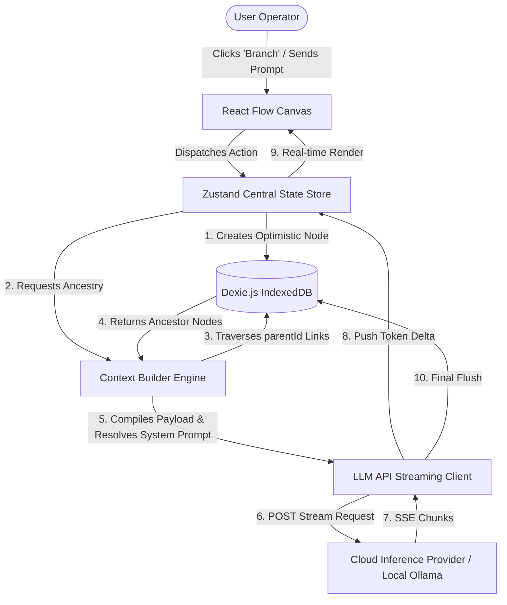
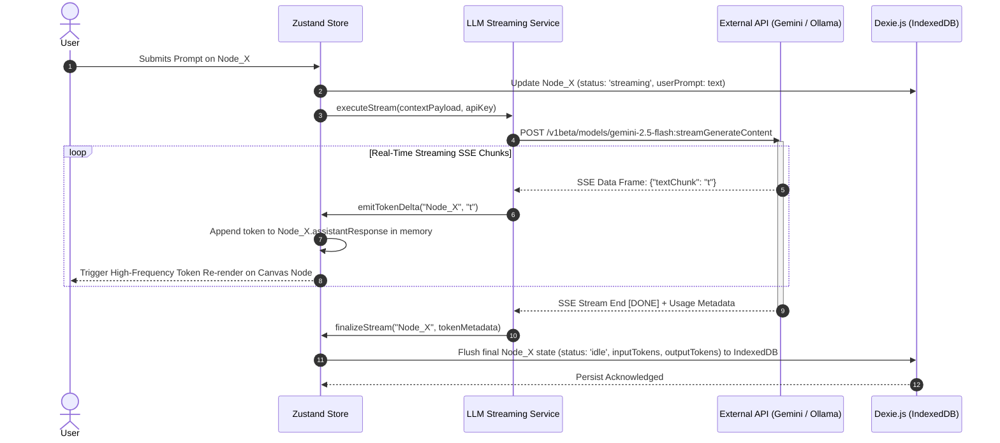

# Software Design Document
## Spatial 2D Conversation Tree Architecture (CTA) for Deep LLM Research

**Document Version:** 1.1.0  
**Status:** Ready for Architectural Review / Engineering Execution  
**Target Audience:** Principal Systems Architects, Lead Engineers, AI CLI Agents (Claude Code, Antigravity CLI)  
**Author:** Lead AI Systems Architect

---

## 1. Problem Statement

Modern conversational AI interfaces (e.g., Gemini Web, ChatGPT, Claude.ai) rely almost exclusively on a 1D linear chat stream model. While effective for single-turn or shallow sequential interactions, this paradigm breaks down completely during complex, multi-faceted research tasks.

When a user conducts deep technical research requiring exploration across multiple sub-questions (e.g., evaluating five distinct system trade-offs), they are forced into one of two systemic failure modes:

```
                  ┌─────────────────────────────────────────┐
                  │      Linear Chat Failure Modes          │
                  └────────────────┬────────────────────────┘
                                   │
            ┌──────────────────────┴──────────────────────────┐
            ▼                                                 ▼
┌───────────────────────┐                       ┌───────────────────────┐
│  1. The Parallel Wall │                       │ 2. Sequential Drift   │
├───────────────────────┤                       ├───────────────────────┤
│ • Ask 5 questions at  │                       │ • Ask 1 question and  │
│   once in 1 turn.     │                       │   dive 5 levels deep. │
│ • Causes extreme      │                       │ • Fills context with  │
│   human cognitive     │                       │   low-level noise.    │
│   overload & tracking │                       │ • Attention drift &   │
│   friction.           │                       │   recency bias ruin   │
│                       │                       │   subsequent questions│
└───────────────────────┘                       └───────────────────────┘
```

### 1.1 The Parallel Wall (Cognitive Overload)

If the user prompts the LLM with 5 complex questions simultaneously:

- The LLM responds with a massive wall of text covering all 5 topics.
- Asking follow-up questions requires referencing specific sub-sections within the wall of text.
- The conversation rapidly devolves into an unmanageable, multi-threaded text log inside a single vertical scrollbar, placing an unbearable mental tracking load on the human operator.

### 1.2 The Sequential Drift (Context Degradation)

If the user explores Question 1 deeply across 5 sequential turns before moving to Question 2:

- The shared linear context window becomes polluted with hyper-specific, low-level details from Question 1.
- Due to Recency Bias and Attention Degradation (Needle-in-a-Haystack degradation), the model's understanding of the original overarching research objective degrades when transitioning to Question 2.
- Tokens are wasted sending obsolete intermediate reasoning paths on every subsequent API call.

### 1.3 History Management & Session Friction

Consumer LLM web interfaces provide poor history organization (flat chronological sidebars without hierarchical search or tags). Users hesitate to clear or organize past chats out of fear of polluting personal profile stores, leaving them stranded in unsearchable, unstructured chat logs.

---

## 2. High-Level Solution

The proposed system replaces the 1D linear scrollbar with a Spatial 2D Conversation Tree Architecture (CTA) implemented as a Client-Side, Local-First, Bring-Your-Own-Key (BYOK) application.

```
               [ Root Node: Overall Research Topic ]
                      /                   \
        [ Branch Q1: Deep Dive ]     [ Branch Q2: High-Level ]
             /          \
   [ Sub-topic 1A ]  [ Sub-topic 1B ]
```

### 2.1 Spatial Isolation & Context Decoupled Ancestry

Instead of appending every turn to a single growing string, conversations are structured as a Directed Acyclic Graph (DAG).

- Each node represents an isolated conversational turn.
- To generate a response at any target node, the system traverses upward along the exact ancestor chain to the root, compiling a clean, isolated context stack.
- Deep exploration in Branch A never leaks tokens, noise, or context pollution into Branch B.

### 2.2 Turn Node Aggregation Pattern

To eliminate visual canvas clutter, a single visual node on the 2D canvas captures a complete Q&A Turn (User Prompt + Assistant Response). This halves the visual node count compared to raw message graphs while maintaining full message identity for context compilation.

### 2.3 Cascading System Prompt Inheritance

The system supports global system instructions at the tree root while allowing any node down a branch to set a `systemPromptOverride`. Sub-branches automatically inherit the nearest ancestor's system prompt, enabling side-by-side comparative analysis under different AI personas (e.g., Performance Engineer vs. Security Auditor) on the exact same upstream context.

### 2.4 Local-First BYOK Model

- **$0 Infrastructure Cost:** Runs 100% client-side in the browser.
- **Direct Inference:** Talks directly to Google AI Studio (Gemini), OpenRouter, or local runners (Ollama / vLLM) via user-provided API keys.
- **Absolute Privacy:** All conversation history, graph positions, and settings are stored locally in browser IndexedDB.

---

## 3. Detailed Design

### 3.1 Architectural Topology

**High-Level System Architecture**

```
┌────────────────────────────────────────────────────────────────────────────────────────┐
│                                 BROWSER CLIENT (REACT)                                 │
│                                                                                        │
│  ┌──────────────────────┐   User Actions   ┌────────────────────────────────────────┐  │
│  │   React Flow Canvas  │ ───────────────► │             Zustand Store              │  │
│  │ (2D Graph Rendering) │ ◄─────────────── │         (Application State)            │  │
│  └──────────────────────┘   State Updates  └───────────────────┬────────────────────┘  │
│                                                                │                       │
│                                              Read / Write Operations                   │
│                                                                ▼                       │
│                                            ┌────────────────────────────────────────┐  │
│                                            │         IndexedDB (Dexie.js)           │  │
│                                            │        (Local Tree Database)           │  │
│                                            └───────────────────┬────────────────────┘  │
│                                                                │                       │
│                                              Ancestry Payload  │ Read                  │
│                                                                ▼                       │
│                                            ┌────────────────────────────────────────┐  │
│                                            │         Context Builder Engine         │  │
│                                            │      (Ancestry Chain Traversal)        │  │
│                                            └───────────────────┬────────────────────┘  │
└────────────────────────────────────────────────────────────────┼───────────────────────┘
                                                                 │ HTTPS / SSE Stream
                                                                 ▼
                                             ┌────────────────────────────────────────┐
                                             │         External Cloud / Local         │
                                             │    (Gemini API / Ollama / OpenRouter)  │
                                             └────────────────────────────────────────┘
```

**System Sub-component Interaction (Mermaid)**



### 3.2 Technology Stack Matrix

| Layer | Technology | Version | Selection Rationale |
|---|---|---|---|
| Framework | React + Vite | ^19.2 / ^8.1 | Blazing fast HMR, small bundle footprint, native TypeScript support. |
| Language | TypeScript | ~6.0 | Strict typing across state, database, and API payloads. |
| Canvas Engine | @xyflow/react (React Flow) | ^12.11 | Industry standard for 2D node graphs. Includes pan/zoom, custom node rendering, edge routing, and viewport controls out of the box. |
| State Management | Zustand | ^5.0 | Unopinionated, ultra-fast client state manager with zero boilerplate. Handles fast-frequency streaming token updates without triggering re-render loops across unrelated nodes. |
| Local Database | Dexie.js | ^4.4 | Minimalist wrapper around browser IndexedDB. Provides ACID-compliant, high-performance local storage with index queries for O(1) node lookups. |
| Layout Engine | @dagrejs/dagre | ^1.0 | Directed graph auto-layout algorithm for calculating clean X, Y coordinates when spawning new child branches automatically. |
| HTTP/SSE Client | Native fetch + ReadableStream | Web Standard | Zero external dependency weight for handling HTTP POST Server-Sent Event streaming responses. |

_This table records the versions actually installed in `package.json`. Update it whenever a major dependency version changes._

### 3.3 Main Architectural System Components

**Canvas View Engine (React Flow Layer):** Renders the 2D spatial plane, grid pattern, connecting Bezier curves, and custom TurnNode components. Intercepts viewport drag/zoom events and passes node selection states to the central store.

**Context Builder Engine:** Encapsulates graph traversal logic. Given an active node ID, it recursively follows `parentId` pointers upward to the root node, collecting user prompts and assistant responses in temporal sequence while resolving cascading system prompts.

**LLM API Proxy Client:** Manages direct client-to-cloud connections. Formats standardized OpenAI/Gemini requests, injects user API keys from local encrypted storage, opens SSE streams, and emits decoded token deltas to state handlers.

**Local Persistence Manager (Dexie.js Layer):** Handles local database initialization, migrations, tree exports/imports (JSON format), and debounced write flushes during active streaming.

### 3.4 Schemas (Matrix Representation)

**Schema Matrix 1: TurnNode (The Atomic Canvas Element)**

| Field Name | Data Type | Nullable | Description | Architectural Usage |
|---|---|---|---|---|
| id | String (UUIDv4) | No | Globally unique identifier generated on client creation. | Primary Key for database indexing and React Flow node binding. |
| treeId | String (UUIDv4) | No | Foreign key linking node to its parent ConversationTree. | Fast query filtering (`db.nodes.where('treeId').equals(id)`). |
| parentId | String (UUIDv4) | Yes | ID of the immediate parent node. `null` if this is the Root Node. | Pointer used to build upstream ancestry chains during context assembly. |
| childrenIds | Array\<String\> | No | Array of child node IDs branching directly from this node. | Used for downstream sub-tree traversal, rendering, and collapse mechanics. |
| userPrompt | String | No | Raw input text submitted by the human operator. | Extracted as `{ role: 'user', content: userPrompt }` in ancestry chain. |
| assistantResponse | String | No | Markdown output generated by the LLM. | Extracted as `{ role: 'assistant', content: assistantResponse }` in ancestry chain. |
| systemPromptOverride | String | Yes | Optional system prompt instruction specific to this branch. | Overrides upstream system prompts for this node and all descendant sub-trees. |
| positionX | Number (Float) | No | X-coordinate on the 2D canvas plane. | Passed to React Flow to render absolute position on canvas. |
| positionY | Number (Float) | No | Y-coordinate on the 2D canvas plane. | Passed to React Flow to render absolute position on canvas. |
| isCollapsed | Boolean | No | Flag indicating if downstream child nodes are hidden from view. | Toggles visual hiding of sub-trees and renders "N Nodes Collapsed" pill. |
| status | Enum String | No | Values: `'idle'`, `'streaming'`, `'error'`. | Controls UI state spinners, streaming border highlights, and error badges. |
| modelUsed | String | No | Identifier of the LLM model (e.g., `'gemini-2.5-flash'`). | Auditing, visual badges on cards, and model configuration tracking. |
| inputTokens | Number | Yes | Token count of the upstream context payload sent to API. | Cost tracking, usage reporting, and context window boundary warnings. |
| outputTokens | Number | Yes | Token count of the response generated by the model. | Cost tracking and generation throughput metrics. |
| timestamp | Number (Int64) | No | Epoch timestamp (milliseconds) of node creation. | Chronological sorting and node creation audit trail. |

**Schema Matrix 2: ConversationTree (The Document Workspace)**

| Field Name | Data Type | Nullable | Description | Architectural Usage |
|---|---|---|---|---|
| id | String (UUIDv4) | No | Unique identifier for the research document. | Primary Key. |
| title | String | No | User-facing workspace name (e.g., "Database Research"). | Displayed in header toolbar and document management sidebar. |
| rootNodeId | String (UUIDv4) | No | ID of the foundational depth-0 node of the tree. | Starting point for tree loading and full-graph rendering. |
| defaultSystemPrompt | String | No | Baseline system prompt instruction applied to all nodes. | Fallback instruction when no ancestor specifies a `systemPromptOverride`. |
| createdAt | Number (Int64) | No | Epoch creation timestamp. | Sorting documents in sidebar list. |
| updatedAt | Number (Int64) | No | Epoch last-modified timestamp. | Updated whenever nodes are added, edited, or deleted. |

**Schema Matrix 3: AppSettings (Global Client Configuration)**

| Field Name | Data Type | Nullable | Description | Architectural Usage |
|---|---|---|---|---|
| id | String | No | Constant key (always `'global_settings'`). | Single-row local config store. |
| geminiApiKey | String | Yes | User's personal Google AI Studio API Key. | Injected into Gemini client requests. |
| openRouterApiKey | String | Yes | User's personal OpenRouter API Key. | Injected into OpenRouter client requests. |
| ollamaBaseUrl | String | No | Endpoint URL for local LLM (default: `http://localhost:11434`). | Target host for local inference streaming. |
| defaultModel | String | No | Default model assigned to newly spawned nodes. | Pre-populates `modelUsed` on node creation. |
| activeTreeId | String (UUIDv4) | Yes | Currently open conversation tree ID. | Restores session state automatically on application startup. |

---

## 4. UI/UX Definitions

### 4.1 Canvas Layout & Mockup Structure

```
┌────────────────────────────────────────────────────────────────────────────────────────────────────────┐
│ [≡] Conversation Tree: Local Architecture                         100%  [ 🔍 Search ] [ + New ] [ ⚙️ ] │
├────────────────────────────────────────────────────────────────────────────────────────────────────────┤
│                                                                                                        │
│                                  ┌──────────────────────────────────┐                                  │
│                                  │ ⚙️ System: Lead Systems Architect │                                  │
│                                  │ 👤 USER: How to structure schema?│                                  │
│                                  │ 🤖 ASSISTANT: Use Dexie.js DAG...│                                  │
│                                  │ [ ➖ Collapse ] [ ➕ Spawn Child ]│                                  │
│                                  └────────────────┬─────────────────┘                                  │
│                                                   │                                                    │
│                    ┌──────────────────────────────┴──────────────────────────────┐                     │
│                    │ (Smooth Bezier Line)                                        │                     │
│                    ▼                                                             ▼                     │
│   ┌──────────────────────────────────┐                         ┌──────────────────────────────────┐   │
│   │ 👤 USER: What about indexing?    │                         │ 🛡️ Override: Security Auditor   │   │
│   │ 🤖 ASSISTANT: Index parentId...  │                         │ 👤 USER: Security implications.. │   │
│   │ [ ➖ Collapse ] [ ➕ Spawn Child ]│                         │ 📦 [ 3 Sub-tree Nodes Collapsed ]│   │
│   └────────────────┬─────────────────┘                         │ [ ➕ Expand Branch ]             │   │
│                    │                                           └──────────────────────────────────┘   │
│            ┌───────┴───────┐                                                                          │
│            ▼               ▼                                                                          │
│   ┌────────────────┐  ┌───────────────────────┐                                                       │
│   │ 👤 USER: Code? │  │ 👤 USER: Migration?   │                                                       │
│   │ 🤖 ASSISTANT...│  │ 📦 [ 1 Node Collapsed]│                                                       │
│   └────────────────┘  └───────────────────────┘                                                       │
│                                                                                                        │
└────────────────────────────────────────────────────────────────────────────────────────────────────────┘
```

### 4.2 Card Geometry & Turn Node Component Structure

```
┌──────────────────────────────────────────────────────────────┐
│  SYSTEM BADGE (Optional)                                     │
│  [ 🛡️ Override: Security Auditor Persona                 ]   │
├──────────────────────────────────────────────────────────────┤
│  USER PROMPT SECTION                                         │
│  👤 "Explain index traversal performance in SQLite."         │
├──────────────────────────────────────────────────────────────┤
│  ASSISTANT RESPONSE SECTION (Markdown + Code Highlighting)   │
│  🤖 Index lookup utilizes a B-Tree structure, yielding       │
│     O(log N) search complexity...                            │
│     ```sql                                                   │
│     CREATE INDEX idx_parent ON nodes(parentId);              │
│     ```                                                      │
├──────────────────────────────────────────────────────────────┤
│  CARD FOOTER / ACTION BAR                                    │
│  [ ⚡ gemini-2.5-flash ] [ ➖ Collapse ] [ ➕ Branch Child ] │
└──────────────────────────────────────────────────────────────┘
```

### 4.3 Node Visual States Matrix

| State Name | Visual Border / Header Indicator | Content Area Behavior | Action Controls Available |
|---|---|---|---|
| Expanded (Default) | Thin glowing Indigo border (`#4F46E5`). | Displays full Markdown text and formatted code blocks. | Collapse, Spawn Child, Edit Prompt, Regenerate. |
| Streaming | Animated pulsing Blue-Cyan border (`#06B6D4`) + Spinner. | Live token text appended in real time with blinking cursor. | Cancel Stream Button. |
| Collapsed Sub-tree | Muted Slate border (`#334155`) with persistent shadow. | Hides downstream children. Renders a prominent pill button: 📦 N Nodes Collapsed. | Expand Sub-tree Button. |
| System Override | Displays an Amber Shield Badge (`#F59E0B`) at card top. | Standard prompt/response viewing. | Edit/Remove System Override. |
| Execution Error | Crimson Red border (`#EF4444`) + Warning Badge. | Displays raw API error message (e.g., Rate Limit Exceeded). | Retry Generation Button. |

---

## 5. Execution Flows & Sequence Specifications

### 5.1 Ancestry Context Traversal & System Prompt Resolution Algorithm

```typescript
// Architectural Specification: Context Resolution Engine

interface MessagePayload {
  role: 'user' | 'assistant';
  content: string;
}

interface ContextResolutionResult {
  systemPrompt: string;
  messages: MessagePayload[];
}

function resolveContextPayload(
  targetNodeId: string,
  nodeMap: Map<string, TurnNode>,
  globalDefaultSystemPrompt: string
): ContextResolutionResult {
  const ancestryChain: TurnNode[] = [];
  let currentNodeId: string | null = targetNodeId;

  // 1. Walk upward using parentId pointers
  while (currentNodeId !== null) {
    const node = nodeMap.get(currentNodeId);
    if (!node) break;

    ancestryChain.unshift(node); // Prepend to preserve chronological order
    currentNodeId = node.parentId;
  }

  // 2. Resolve Cascading System Prompt
  // Scan backwards (from target node up to root) for the first explicit override
  let resolvedSystemPrompt = globalDefaultSystemPrompt;
  for (let i = ancestryChain.length - 1; i >= 0; i--) {
    if (ancestryChain[i].systemPromptOverride && ancestryChain[i].systemPromptOverride!.trim() !== '') {
      resolvedSystemPrompt = ancestryChain[i].systemPromptOverride!;
      break; // Found nearest ancestor override
    }
  }

  // 3. Unfold Turn Nodes into API Message Array
  const messages: MessagePayload[] = [];
  for (const node of ancestryChain) {
    if (node.userPrompt && node.userPrompt.trim() !== '') {
      messages.push({ role: 'user', content: node.userPrompt });
    }
    // Only append assistant response if it exists (skip current node's empty response)
    if (node.assistantResponse && node.assistantResponse.trim() !== '' && node.id !== targetNodeId) {
      messages.push({ role: 'assistant', content: node.assistantResponse });
    }
  }

  return {
    systemPrompt: resolvedSystemPrompt,
    messages: messages
  };
}
```

### 5.2 SSE Real-time Streaming & Synchronization Sequence



---

## 6. Execution Strategy & Phased Build Plan

To mitigate development risk, the implementation is structured as a Targeted MVP First (Phases 1–3) followed by Post-MVP Enhancements (Phase 4).

```
┌────────────────────────────────────────────────────────────────┐
│                        DEVELOPMENT RISK MATRIX                 │
├───────────────────────────────────┬────────────────────────────┤
│         LOW RISK (Backend)        │   HIGH RISK (Canvas UX)    │
├───────────────────────────────────┼────────────────────────────┤
│ • Dexie.js schema creation        │ • React Flow re-renders    │
│ • Ancestry traversal algorithm    │   during SSE               │
│ • Gemini SSE streaming fetch      │ • Dynamic node height      │
│                                   │   recalculation            │
│                                   │ • Canvas viewport          │
│                                   │   auto-focusing            │
└───────────────────────────────────┴────────────────────────────┘
```

### 6.1 Phase 1: Core Foundation & Storage Setup (MVP Scope)

- Initialize Vite + React + TypeScript + Tailwind CSS project.
- Define Dexie.js database schema (`ChatDatabase.ts`) matching matrices in Section 3.4.
- Implement Zustand central state store (`useTreeStore.ts`) managing nodes, active tree state, and IndexedDB persistence.

### 6.2 Phase 2: Canvas Integration & Turn Node Component (MVP Scope)

- Install `@xyflow/react` and establish main spatial canvas container.
- Build custom TurnNode React component matching geometry defined in Section 4.2.
- Wire node drag, zoom, panning, and connecting Bezier edge handlers to Zustand store.

### 6.3 Phase 3: Context Engine & Streaming API Client (MVP Scope)

- Implement `resolveContextPayload()` traversal logic for ancestor chains and system prompt resolution.
- Build native browser SSE client handling token streaming for Google AI Studio (Gemini API) and local Ollama endpoints.
- Wire real-time streaming deltas into React Flow node cards with optimistic state updates.

### 6.4 Phase 4: Advanced Features & Post-MVP Polish

- Integrate `@dagrejs/dagre` auto-layout algorithm for automatic branch positioning.
- Implement cascading system prompt overrides and visual amber shield badges.
- Build sub-tree collapse/expand UI mechanics and visual aggregated count badges (📦 N Nodes Collapsed).
- Implement zero-dependency JSON export/import handlers for session backup and restore.

---

## 7. Claude Code / Agent Execution Workflow & Harness

This section defines the mandatory operational directives for AI CLI agents (Claude Code, Antigravity CLI) executing this codebase.

### 7.1 Initialization Directives

Before writing application code, the AI CLI agent MUST create two project harness files in the repository root:

- **`CLAUDE.md`**: The permanent architectural and style guide for the agent.
- **`tasks.md`**: A granular, checkable task matrix broken down by the phases defined in Section 6.

### 7.2 CLAUDE.md Specification Blueprint

The generated `CLAUDE.md` MUST contain the following rules:

```markdown
# Agent Execution Guidelines: Spatial Conversation Tree Architecture

## Code Style & Architecture Constraints
- Framework: React 19 + Vite 8 + TypeScript 6 (Strict Mode).
- Canvas Engine: @xyflow/react (React Flow v12).
- State Management: Zustand 5 (Store mutating actions must be immutable).
- Database: Dexie.js (IndexedDB). Always use async/await for Dexie transactions.
- Styling: Tailwind CSS (Dark theme slate/indigo palette).

## Immutability & State Updates
- NEVER mutate state objects directly (e.g., `node.content += chunk`).
- ALWAYS use functional Zustand updates with new object references to prevent React Flow re-render locks.

## Component Modularization Rules
- Max 150 lines per component file.
- Separate UI component rendering from store logic.
```

### 7.3 tasks.md Initial Task Matrix

The agent MUST track implementation progress using a checkable task list structured as follows:

```markdown
# Execution Tasks Matrix

## Phase 1: Core Foundation & Storage Setup
- [ ] Initialize Vite + React + TypeScript + Tailwind CSS project
- [ ] Implement Dexie.js database schema (`ChatDatabase.ts`)
- [ ] Implement Zustand central state store (`useTreeStore.ts`) with Dexie persistence

## Phase 2: Canvas Integration & Turn Node Component
- [ ] Install `@xyflow/react` and configure main canvas container
- [ ] Build custom `TurnNode` component (Prompt + Response card layout)
- [ ] Wire node dragging, viewport panning/zooming, and edge rendering to Zustand store

## Phase 3: Context Engine & Streaming API Client
- [ ] Implement `resolveContextPayload()` parent chain traversal logic
- [ ] Implement native SSE streaming fetch client for Gemini API & Ollama
- [ ] Connect real-time streaming deltas to active node state

## Phase 4: Advanced Features & Polish
- [ ] Implement cascading system prompt overrides and UI shield badges
- [ ] Implement sub-tree collapse/expand mechanics (`📦 N Nodes Collapsed`)
- [ ] Integrate `@dagrejs/dagre` for automated branch layout
- [ ] Implement JSON tree export/import backup pipeline
```

### 7.4 The Rigid "Implement → Test → Commit" Execution Loop

For EVERY individual task in `tasks.md`, the AI CLI agent MUST execute the following strict 3-step cycle:

```
┌────────────────────────────────────────────────────────────────────────┐
│                   THE TASK EXECUTION TRIPLE CYCLE                      │
├────────────────────────────────────────────────────────────────────────┤
│                                                                        │
│   1. IMPLEMENT                                                         │
│   ──► Write modular code for ONE single task in `tasks.md`.            │
│                                                                        │
│   2. TEST & VERIFY                                                     │
│   ──► Run `npm run check` or `tsc --noEmit` to verify type safety.     │
│   ──► Verify component rendering and state store logic.                │
│                                                                        │
│   3. COMMIT & MARK COMPLETE                                            │
│   ──► Mark task as completed `[x]` in `tasks.md`.                      │
│   ──► Perform git commit: `git commit -m "feat(phase-X): task details"`│
│                                                                        │
└────────────────────────────────────────────────────────────────────────┘
```

**Step 1 — Implement:** Write clean, typed, modular code addressing only the current active task in `tasks.md`. Do not attempt multi-task scope creep.

**Step 2 — Test & Verify:** Execute `npx tsc --noEmit` and build checks. Confirm that types resolve, zero lint errors exist, and state modifications adhere to immutability rules.

**Step 3 — Commit & Mark Complete:** Update `tasks.md` to check off `[x]` the completed task, then issue a clean Git commit before proceeding to the next task.

---

*[ END OF SOFTWARE DESIGN DOCUMENT ]*
